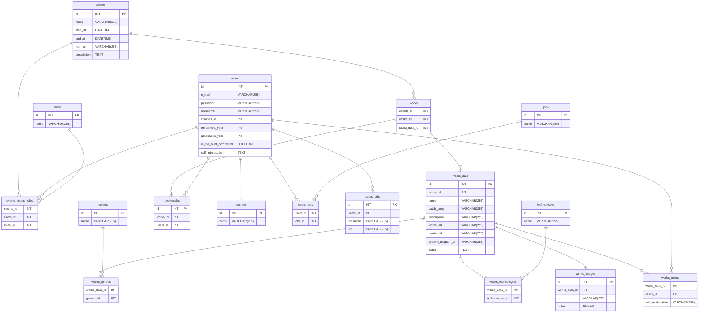

```mermaid
erDiagram

    events ||--o{ events_users_roles : ""
    events ||--o{ works : ""
    works ||--o{ works_data : ""
    works_data ||--o{ works_genres : ""
    works_data ||--o{ works_technologies : ""
    works_data ||--|{ works_images : ""
    works_data ||--o{ works_users : ""
    works ||--o{ bookmarks : ""
    users ||--o{ works_users : ""
    users ||--o{ bookmarks : ""
    users ||--o{ events_users_roles : ""
    users ||--|| courses : ""
    users ||--o{ users_jobs : ""
    users ||--o{ users_urls : ""
    jobs ||--o{ users_jobs : ""
    genres ||--o{ works_genres : ""
    technologies ||--o{ works_technologies : ""
    roles ||--o{ events_users_roles : ""


    events {
        id INT PK
        name VARCHAR(255)
        start_at DATETIME
        end_at DATETIME
        icon_url VARCHAR(255)
        description TEXT
    }

    users {
        id INT PK
        e_mail VARCHAR(255)
        password VARCHAR(255)
        username VARCHAR(255)
        courses_id INT
        enrollment_year INT
        graduation_year INT
        is_job_hunt_completed BOOLEAN
        self_introduction TEXT
    }

    bookmarks {
        id INT PK
        works_id INT
        users_id INT
    }

    works {
        events_id INT
        works_id INT
        latest_data_id INT
    }

    works_data {
        id INT PK
        works_id INT
        name VARCHAR(255)
        catch_copy VARCHAR(255)
        description VARCHAR(255)
        works_url VARCHAR(255)
        movie_url VARCHAR(255)
        system_diagram_url VARCHAR(255)
        detail TEXT
    }

    works_images {
        id INT PK
        works_data_id INT
        url VARCHAR(255)
        order TINYINT
    }

    genres {
        id INT PK
        name VARCHAR(255)
    }

    technologies {
        id INT PK
        name VARCHAR(255)
    }

    works_users {
        works_data_id INT
        users_id INT
        role_explanation VARCHAR(255)
    }

    users_jobs {
        users_id INT
        jobs_id INT
    }

    jobs {
        id INT PK
        name VARCHAR(255)
    }

    courses {
        id INT PK
        name VARCHAR(255)
    }

    roles {
        id INT PK
        name VARCHAR(255)
    }

    users_urls {
        id INT PK
        users_id INT
        url_name VARCHAR(255)
        url VARCHAR(255)
    }

    works_genres {
        works_data_id INT
        genres_id INT
    }

    works_technologies {
        works_data_id INT
        technologies_id INT
    }

    events_users_roles {
        events_id INT
        users_id INT
        roles_id INT
    }

```
